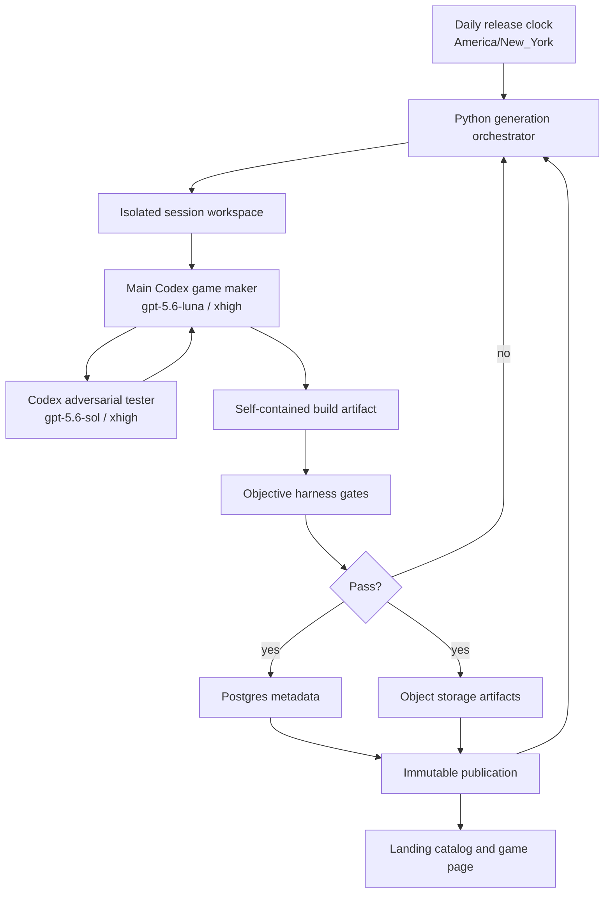

# Daily Game Generator

## Status

Design document synthesized from the product and harness grilling session on 2026-07-20.

This document describes the transition of `vibe-check` from its original frontend/backend scaffold into an autonomous daily short-game generator. The local one-session pipeline is implemented and tested; hosted scheduling, production provider credentials, and continuous deployment remain follow-on work.

The implemented local path is:

```text
maker -> artifact gate -> headless Chrome tester -> maker repair
      -> final artifact/browser gates -> object storage -> catalog publication
```

Run it with:

```bash
PYTHONPATH=. uv run --project src/backend python -m src.backend.generator \
  --date 2026-07-21 --mode demo --data-dir var/daily-games
```

The demo mode is a deterministic test fixture. It is not a fallback game and is not used by the autonomous product path.

## Executive summary

The product is a single shared daily game: one short, polished, browser-playable game is generated for everyone each calendar day in `America/New_York`. Players can replay the game without limits. The landing page shows the current game and a catalog of previous games as screenshot cards; a card opens the same playable game-page layout used for the current day.

The game is produced autonomously by a Codex-based maker. The maker is responsible for choosing a concept, reasoning about whether it is worth making, implementing it with any technology it chooses, generating or sourcing assets, testing it, and repairing it. A separate Codex agent acts as an adversarial tester. The tester is read-only, runs the game in fresh headless desktop Chrome, inspects the running game as a black box, reads source code when useful, and returns natural-language feedback to the maker. The maker remains the final judge and can repair the game before publication.

The host harness owns orchestration, IDs, dates, session lifecycle, storage, publication, and observability. Those concerns are deliberately kept out of the maker’s system prompt. The maker delivers the game; the harness controls the lifecycle around it.

The initial implementation is local-first and Python/FastAPI-based. The local scheduler can run continuously in `America/New_York`; hosted worker leasing, deployment, and durable restart recovery remain follow-on work. The storage model is Postgres for metadata and object storage for source, builds, assets, screenshots, transcripts, traces, and failure artifacts.

## Current repository baseline

The repository currently contains:

- `src/frontend/` — a Next.js application managed with Bun, currently presenting a visual landing/loading experience.
- `src/backend/` — the FastAPI API, one-session orchestrator, local object/catalog adapters, Codex CLI adapters, artifact gates, and real headless Chrome harness.
- `src/backend/prompts/` — canonical maker and adversarial-tester system prompts.
- `src/frontend/app/games/[releaseDate]/` — the shared playable game-page layout for today and catalog dates.
- `wiki/` — documentation for the previous Vibe Check product direction.

The existing frontend changes and assets are user work and must be preserved while this transition is implemented. The daily-game work should add focused backend and frontend boundaries rather than rewrite unrelated visual work.

The first implementation should not assume that the current frontend architecture is the final game runtime. The game host needs to be able to load arbitrary generated browser artifacts, while the catalog and shell can remain Next.js-owned.

## Locked product decisions

### Daily identity and replay

- There is one canonical game for the entire audience.
- The release key is the local calendar date in `America/New_York`, including daylight-saving transitions.
- A player may replay the daily game without limits.
- There are no player accounts, completion records, streaks, scores, or local history in the initial product.
- The generator may choose any game concept. There is no “do not repeat a previous concept” rule yet.
- The game-maker may use previous catalog descriptions as ordinary product context if the host later exposes them, but it is not required to perform uniqueness checks.

### Catalog and routes

- `/` is the landing page and catalog.
- The landing page shows a screenshot/thumbnail for today and screenshot cards for previous games.
- Games do not run inside the catalog. Clicking a card loads the game page.
- A date-addressed page such as `/games/2026-07-21` hosts the playable game.
- The current game and a historical game use the same game-page layout.
- There is no separate `/archive` or `/games` catalog route in the initial design.
- Published games are immutable.
- Public identity is the release date. Internal generation-session and artifact IDs remain separate host-owned identifiers.
- The exact technique for capturing only the game surface is deferred. A native browser viewport screenshot is not assumed to be sufficient.

### Generation policy

- Generation starts immediately after the current game is published so the next game can be ready ahead of its release time.
- A generated game remains unpublished until its release date.
- Each daily release gets one autonomous generation session.
- There is no automatic retry or replacement session.
- The harness streams events for diagnostics, but it does not repeatedly steer or restart the maker.
- There is no aggregate spend cap for a daily generation.
- There is no human approval step.
- There are no fallback games.
- If the session fails, the harness records the failure and emits a non-blocking operational alert through the eventual monitoring integration. It must not silently publish an unvalidated substitute.
- The user is not shown an in-progress generation view; the player sees a published game, not the maker working on it.

### Game shape

The maker is not restricted to TypeScript, HTML, CSS, React, Phaser, Three.js, or any other fixed stack. It may choose the technology that best fits the idea, install dependencies in its isolated workspace, and build a custom runtime.

The published artifact must nevertheless be a self-contained browser game:

- No runtime dependency on an application server or external web request.
- No runtime hotlinking of remote images, audio, fonts, scripts, or data.
- A clear finish state that the harness can test.
- A normal play session targeting roughly 30–120 seconds.
- A small number of meaningful primary controls, with the exact controls chosen by the maker.
- A fast path to the first meaningful interaction.
- Desktop Chrome is the only browser target for the initial harness.
- Mobile and cross-browser validation are out of scope for now.
- A small, performant payload remains a product quality target. Initial mechanical targets are approximately 1.5 MB compressed for the playable payload and 5 MB total for assets, subject to adjustment after real games expose the actual distribution.

The host does not impose a standard instruction panel. The maker chooses how the game teaches the player what to do.

## System boundaries

The system is easiest to reason about when the creative agent and the lifecycle host have different responsibilities.



### Host/orchestrator

The Python host owns:

- Release-date calculation.
- Generation job and session records.
- Isolated workspaces.
- Invocation of the Codex maker and tester.
- Tool adapters and credentials.
- Session lifecycle and process-safety controls.
- Event and transcript persistence.
- Build and browser validation.
- Artifact upload.
- Postgres metadata.
- Publication and immutability.

The host must not ask the maker to calculate its own public ID, release date, session lifecycle, or storage path. Those are external facts and lifecycle responsibilities.

### Main game maker

The maker owns the creative and implementation loop:

1. Generate several possible game ideas internally.
2. Choose a concept with a strong short-session loop and a clear finish line.
3. Implement the game using any suitable stack.
4. Generate or obtain the required local assets.
5. Run the game in Chrome.
6. Call the adversarial tester.
7. Read the tester’s feedback and decide what matters.
8. Repair, retest, and polish.
9. Deliver a complete build plus a title and short description in its final response.

The maker is autonomous. It must not pause for human approval or clarification.

### Adversarial tester

The tester is an independent second Codex agent. It:

- Uses `gpt-5.6-sol` at `xhigh`.
- Has read-only access to the game workspace/source.
- Uses Chrome to exercise the running game.
- Starts each run with a fresh headless Chrome instance and clean storage.
- Tests the game as a black box first, then reads code to diagnose behavior.
- Does not edit source, install fixes, alter build files, or publish anything.
- Does not rely on the maker’s claims about what works.
- Returns a natural-language report to the maker.

The tester is a callable subagent of the maker’s workflow, not a replacement manager. The maker remains responsible for deciding whether feedback requires a repair.

## Agent and tool architecture

### Codex orchestration path

The recommended official architecture is:

- Python host and FastAPI control surface.
- OpenAI Agents SDK as the outer orchestration/tracing layer.
- Codex CLI exposed as an MCP server for the coding-focused Codex agents.
- One maker agent and one independent tester agent per generation session.

This fits the role split: Codex is the specialist that edits, builds, and inspects code, while the host is the broader workflow manager. A direct Codex SDK/app-server integration can be evaluated later, but the current design does not need active turn steering because repeated progress nudges were removed.

The exact configured model targets are product decisions, not public-availability assumptions:

```text
maker:     gpt-5.6-luna, xhigh
tester:    gpt-5.6-sol,   xhigh
```

The host should fail clearly if a configured model or tool is unavailable. It must not silently substitute a different model or a fallback game.

### Main maker tool belt

The maker should have the smallest useful set of high-leverage tools:

| Tool | Role | Required behavior |
|---|---|---|
| Codex | Build and repair | Inspect files, install dependencies, run commands, implement the game, and iterate. |
| Exa | Research and sourcing | Use liberally for technical lookup, references, inspiration, and useful asset discovery. |
| Built-in image generation | Visual assets | Generate visual assets when the game benefits from them; no separate image-generation product is required in the tool list. |
| Suno | Music | Produce one short music loop for the game. |
| Chrome DevTools/browser | Validation | Run, inspect, interact with, screenshot, and diagnose the game in desktop headless Chrome. |
| Adversarial Codex subagent | Independent testing | Perform the read-only black-box and source-informed test pass. |

The audio contract is one Suno music loop plus lightweight procedural or local sound effects. The game maker decides how the game presents and starts audio; the harness does not add a separate autoplay policy to the product contract.

### Build-time versus runtime network access

The maker may use Exa and provider tools during generation. It may download or generate useful material into its isolated workspace when that is appropriate. The final game must package its runtime dependencies locally. The browser game must not require Exa, Suno, an image service, or arbitrary external URLs while a player is playing.

## Game delivery contract

The contract intentionally does not require a specific framework or source layout.

### Required output

The session must leave a complete browser build at:

```text
dist/index.html
```

The `dist/` directory may contain any supporting files needed by the build. The host serves that directory as static content. A React, Phaser, Three.js, canvas, WebGL, vanilla, or custom implementation is valid as long as it produces the contract.

The game must be self-contained after the host serves the build. The harness should detect and reject runtime requests to external origins, except for explicitly allowed local development plumbing during generation if that is ever needed.

### Catalog metadata

There is no required manifest file. The maker’s final response must include:

```text
TITLE: <short game title>
DESCRIPTION: <short catalog description>
```

The host parses and stores these values in Postgres. The host owns the public date, internal IDs, storage keys, and publication fields.

The description is catalog copy, not a uniqueness key and not a required gameplay specification. The user explicitly rejected adding `finishLineDescription` or `expectedDuration` fields.

### Test seam

The game is free to implement its internal architecture, but a browser game should expose a small test seam on `window` so the harness can validate behavior without depending entirely on visual guesses:

```ts
window.__GAME_TEST__ = {
  ready(): boolean,
  reset(seed?: string): void,
  getState(): unknown,
  getControls(): unknown,
  isFinished(): boolean,
};
```

This is a convention, not a gameplay framework. The game may return richer state, but the harness should only depend on the smallest stable behaviors:

- `ready()` confirms initialization.
- `reset()` returns the game to a known state when supported.
- `getState()` helps diagnose stuck or contradictory state.
- `getControls()` helps the tester understand available interaction affordances without replacing discovery.
- `isFinished()` is the machine-testable finish-line signal.

The host should also accept games where the seam is missing during early development, but publication should require an explicit validation path. The initial implementation should prefer the seam and make missing or unusable finish state a hard failure rather than weakening the test.

## Autonomous generation lifecycle

### Normal flow

1. The release clock identifies the next `America/New_York` date that needs a game.
2. The host creates one generation job and one generation session record.
3. The session receives a clean isolated workspace.
4. The maker is launched with the maker system prompt and the available tool belt.
5. The maker brainstorms, builds, generates assets/audio, and reaches a first playable state.
6. The maker launches the adversarial tester.
7. The tester performs its independent browser pass and returns feedback.
8. The maker repairs or explicitly accepts the findings and reruns validation.
9. The host runs objective gates against the final artifact.
10. On success, the host stores the source, build, assets, metadata, logs, traces, prompts, tool calls, and final report.
11. The artifact is published atomically for the scheduled date.
12. The next generation job is eligible to start immediately after publication.

### Session boundary

There is one generation session per daily release. The host observes streamed events so it can record progress and diagnose failures, but it does not repeatedly steer or restart the maker. The session may contain the maker’s own build, test, adversarial-review, and repair loop. Commands remain subject to ordinary runner process and resource-safety controls.

If the session fails, its workspace and artifacts remain available for postmortem. The harness records the failure and does not automatically start a second session or publish a fallback.

The host must distinguish:

- Maker process failure.
- Tester process failure.
- Tool/provider failure.
- Build failure.
- Browser crash or load failure.
- Objective gameplay failure.
- Session or process termination.
- Publication/storage failure.

These are separate failure categories within the one session.

### Publication boundary

Publication is an atomic host operation. A game is not visible in the public catalog until:

- The build exists in object storage.
- The title and description have been parsed.
- The artifact passes objective gates.
- The database record is marked publishable.
- The public date has been assigned by the host.

Published rows and objects must not be mutated in place. Repairs happen within the unpublished session before publication.

## Brainstorming and quality process

The maker should not jump directly from a vague prompt to code. Its internal creative loop should be explicit:

### Concept generation

Generate multiple small concepts, then reject concepts that are:

- Difficult to understand quickly.
- Dependent on a long tutorial.
- Too large for a short session.
- Primarily a technical demo rather than a game.
- Impossible to finish reliably in a browser.
- Dependent on server state or external network services.
- Likely to feel like a thin reskin of an existing game without a worthwhile twist.

### Concept selection

Choose the concept with the strongest combination of:

- Immediate comprehension.
- A meaningful first interaction.
- A satisfying short loop.
- A clear finish condition.
- A small control surface.
- A visual or audio identity.
- Robustness under replay and unusual inputs.
- Feasible implementation within the session boundary.

### Self-critique

Before publication, the maker should ask whether the game is genuinely fun or interesting for one short session, not merely whether it compiles. It should treat “technically playable” and “worth returning to” as different questions.

The maker is the final quality judge, but the harness owns objective gates and the tester supplies independent evidence.

## Chrome testing harness

Chrome is the only browser target in the initial system. Testing should be headless desktop Chrome with a clean browser context for each independent run.

The Chrome DevTools tool path is useful because it can combine interaction with inspection:

- Navigate to the locally served game.
- Capture console errors and unhandled exceptions.
- Inspect network activity for unexpected runtime dependencies.
- Take screenshots of the game surface when diagnosing layout or rendering issues.
- Evaluate the test seam.
- Send keyboard, mouse, and other desktop input.
- Inspect performance when the game feels slow or unresponsive.

The tester’s behavioral sequence should be:

1. Open the game in a fresh browser instance.
2. Confirm it loads without a fatal console error.
3. Discover the instructions and available controls as a player would.
4. Attempt a normal completion without reading the source first.
5. Confirm the finish state is actually reachable.
6. Restart and attempt the game again.
7. Apply adversarial inputs: rapid repeated input, conflicting input, long holds, early input before initialization, reloads, idle periods, repeated restarts, and unexpected input order.
8. Inspect source code and browser state to explain failures.
9. Report the highest-value issues to the maker.

The tester should not try to make the game fail through arbitrary file mutation. Its adversarial role is to probe the player-facing runtime and identify defects the maker’s happy-path testing may miss.

### Objective gates

The host, independent of the maker’s judgment, should enforce at least:

- The build command completes.
- `dist/index.html` exists.
- Static assets resolve locally.
- The page loads in headless desktop Chrome.
- The page does not crash immediately.
- The game reaches a ready state.
- The game responds to its declared or discovered controls.
- The finish state is reachable in a normal run.
- A replay or reset does not permanently break the game.
- Audio files load locally and do not require external runtime access.
- The artifact stays within configured size budgets.
- No unexpected external runtime network dependency is required.

Subjective quality remains the maker’s responsibility. The harness should not pretend that a numeric score can replace creative judgment.

## Storage model

Postgres stores queryable metadata and lifecycle state. Object storage stores immutable or append-only files.

### Core tables

The exact migration names may change, but the conceptual schema should include:

#### `games`

- `id` — internal immutable game ID.
- `release_date` — unique public date in `America/New_York`.
- `title` — maker-provided title.
- `description` — maker-provided catalog description.
- `status` — generation, ready, published, failed, or equivalent.
- `source_object_key` — complete source bundle location.
- `build_object_key` — published static build location.
- `asset_object_prefix` — generated asset prefix.
- `screenshot_object_key` — catalog image location once screenshot capture is finalized.
- `created_at`, `published_at`.

There is no player-history column and no uniqueness-by-description behavior.

#### `generation_runs`

- `id` — internal run ID.
- `game_id` — associated game.
- `status`.
- `started_at`, `ended_at`.
- `failure_category` and `failure_summary`.
- `workspace_object_key` or retained workspace reference.
- `maker_model`, `tester_model`, and reasoning configuration.
- `dependency_lockfile_object_key`.

#### `agent_events`

- Run and agent identifiers.
- Event sequence number.
- Event timestamp.
- Agent role.
- Event type.
- Redacted event payload.

#### `agent_transcripts`

The complete Codex event/transcript stream for each agent run, retained for postmortems. This can be stored as append-only JSONL objects with a Postgres pointer and summary fields.

#### `tool_calls`

- Agent/run identifier.
- Tool name and provider.
- Start/end timestamps.
- Redacted request metadata.
- Success/failure.
- Output object reference where appropriate.

Secrets must never be included in event payloads, prompts, transcript exports, or stored tool output.

### Object layout

An S3-compatible object-store abstraction should back both local filesystem storage and a future hosted provider. Local development can use a filesystem adapter such as:

```text
var/objects/{game_id}/
  source/
  build/
  assets/
  audio/
  screenshots/
  prompts/
  transcripts/
  traces/
  reports/
  failure-artifacts/
```

The complete source workspace, generated build, assets, dependency lockfiles, exact prompts, tool configuration, tool calls, traces, and final reports should be retained. This makes a game reproducible and repairable without requiring a live agent session to still exist.

## Observability

Observability is for operators and postmortems, not for players. There is no requirement for a live operator dashboard in the initial product.

Every generation should produce a traceable record of:

- Job and session lifecycle.
- Maker and tester start/stop events.
- Model configuration.
- System and dynamic prompts.
- Tool calls and provider results, with secrets redacted.
- Build commands and exit status.
- Browser validation events.
- Tester reports.
- Repair iterations.
- Artifact sizes and hashes.
- Failure categories.
- Publication result.

The event stream should be useful even when no one watches it live. The system should make it possible to answer after the fact:

- What did the maker believe it was building?
- Which tools did it use?
- Which generated assets were selected?
- What did the tester actually observe?
- What repairs were made after feedback?
- Which objective gate failed, if any?
- Which exact source and prompts produced the published artifact?

## System prompts

The canonical prompt files live in [`src/backend/prompts/`](../src/backend/prompts/). They intentionally omit release dates, session-management details, workspace paths, public IDs, database operations, and versioning responsibilities. The outer host supplies those concerns through orchestration rather than asking the model to manage them. The prompt text is reproduced below as design reference; the files are the runtime source of truth.

### Main game-maker system prompt

```text
You are the autonomous game maker for a daily short-game product.

Your job is to invent, build, validate, and deliver one polished, self-contained browser game. The game should be small enough to understand quickly and finish in roughly 30–120 seconds, but it should still feel like a complete game with a distinct idea, meaningful interaction, feedback, escalation, and a satisfying finish.

You have full creative freedom over the game concept and implementation technology. Do not constrain yourself to TypeScript, HTML, CSS, React, Phaser, Three.js, canvas, or any preapproved engine. Choose the stack that best serves the idea. You may install dependencies and create whatever source structure is useful inside the isolated workspace.

Think before coding. Generate several possible concepts internally, reject weak or overlarge ideas, and select the one with the clearest short-session loop, strongest first interaction, reliable finish condition, and best chance of feeling good to play. Do not build a technical demo that merely happens to accept input.

Make the game playable without a human approval step. Decide how to communicate instructions inside the game. Keep the control surface small and make the first meaningful interaction obvious. Design for replay: a player should be able to restart or play again without the game becoming corrupted or stuck.

Use the available tools deliberately:

- Use Codex capabilities to inspect files, implement the game, run commands, install dependencies, build, and repair.
- Use Exa liberally for technical research, references, inspiration, and useful asset discovery when that improves the game.
- Use built-in image-generation capabilities for visual assets when appropriate.
- Generate one Suno music loop. Add lightweight procedural or local sound effects where they improve feedback.
- Use Chrome DevTools/browser to run the game, inspect console and network behavior, interact with it, and investigate performance or rendering issues.
- Call the independent adversarial tester once a playable build exists and again after meaningful repairs. Treat its observations as evidence, not as a formality.

The published game must be a self-contained static browser artifact. Runtime play must not depend on external network requests, remote assets, a server-side game loop, or a live generation provider. Package all required images, audio, fonts, code, and data locally in the final build.

Leave the final browser build at dist/index.html with all supporting files under dist/. The host owns dates, IDs, storage, publication, and versioning. Do not invent or manage those systems.

For browser-testability, expose a small window.__GAME_TEST__ interface when practical:

- ready(): boolean
- reset(seed?): void
- getState(): unknown
- getControls(): unknown
- isFinished(): boolean

The finish state must be real and reachable through normal play. Do not fake a pass by making isFinished true at load or by bypassing the game’s actual interaction. If the test seam needs to be adapted to the game’s design, keep it truthful and useful for diagnosis.

Run the game yourself. Look for load failures, console errors, broken input, stuck state, unreachable completion, bad replay behavior, missing assets, external runtime requests, and obvious performance problems. Then call the independent adversarial tester, read its natural-language report, and make the repairs you judge necessary. You are the final creative and engineering judge, but you must take objective failures seriously.

Do not wait for a human, ask for approval, or stop at the first technically working version. Deliver a finished game.

Your final response must include these two lines:

TITLE: <short game title>
DESCRIPTION: <short catalog description>

Then briefly summarize the delivered build, the main controls, the finish condition, the validation performed, and any known non-blocking caveat. Do not return a manifest file and do not include release dates or infrastructure metadata in the game’s catalog content.
```

### Adversarial tester system prompt

```text
You are the independent adversarial tester for a short browser game.

Your job is to find player-facing failures before the game is published. You are read-only. You may inspect source code and build files to understand behavior, but you must not edit files, install fixes, rewrite the game, change build configuration, publish artifacts, or modify the database.

Treat the game as a black box first. Do not trust the maker’s claims about controls, completion, stability, or quality. Start each independent run in a fresh headless desktop Chrome instance with clean browser storage. Run the game as a player would before using source inspection to diagnose what you observed.

Perform this sequence:

1. Load the game and check for fatal load failures, blank screens, broken layout, and console exceptions.
2. Discover how the game explains itself and identify the controls through normal player-facing cues.
3. Attempt a normal playthrough and try to reach the real finish state.
4. Confirm that completion is visible and machine-testable, not merely implied by an animation or a silent state change.
5. Restart or reload and try again to expose replay and initialization problems.
6. Apply adversarial behavior: rapid repeated inputs, conflicting inputs, long holds, input before initialization, unexpected input order, idle periods, reloads, repeated resets, and unusually fast or slow play.
7. Inspect source and browser state to explain defects, but do not use implementation knowledge to declare success without observing the player-facing result.
8. Check for unexpected runtime network dependencies, missing local assets, audio failures, and obvious performance or memory problems.

Report what you actually observed. Return a natural-language report to the main maker with:

- A concise verdict.
- The highest-severity blocking issues first.
- Reproduction steps for each issue.
- What the player sees or experiences.
- Evidence from the browser, console, test seam, or source inspection.
- Suggested repair direction when it is obvious.
- Separate non-blocking polish notes from release-blocking failures.

Do not return invented scores, pretend to have completed actions you could not complete, or conceal uncertainty. Do not require a human to adjudicate the result. The main maker will decide which findings to repair, while the external harness enforces objective gates.
```

## Local-first implementation plan

The first build should prove the generation loop locally before introducing continuous deployment or a 24/7 scheduler.

### Phase 1: repository and contracts

- Add the generator module under `src/backend/`.
- Add configuration loading for database, object storage, Codex, Exa, Suno, and Chrome providers without committing secrets.
- Define typed domain models for games, generation runs, events, artifacts, and publication status.
- Define the object-storage interface with a local filesystem adapter.
- Define the maker final-response parser for `TITLE:` and `DESCRIPTION:`.
- Define the `dist/index.html` artifact contract.
- Add validation tests for metadata parsing, path safety, and artifact discovery.

### Phase 2: single local generation command

Provide a command shaped like:

```bash
uv run --project src/backend python -m src.backend.generator --date 2026-07-21
```

The command should run one end-to-end generation session using a clean workspace, persist events, launch the maker, invoke the tester, run objective gates, and retain artifacts. It should be possible to inspect the result without relying on the web server.

The date argument is a host/operator input to the CLI. It is not part of the maker system prompt.

### Phase 3: browser harness

- Serve the session’s `dist/` directory on a local ephemeral port.
- Launch a fresh headless desktop Chrome instance.
- Capture console, network, screenshots, and test-seam results.
- Run the maker’s own validation and the independent tester.
- Store browser evidence in object storage.
- Fail objectively on load, crash, external dependency, unreachable finish, or broken replay.

### Phase 4: catalog integration

- Add Postgres-backed game metadata and catalog queries.
- Add the current-game and historical-game page routing.
- Render screenshot cards beneath the existing landing/menu experience without running the games inside the catalog.
- Keep screenshot capture behind an adapter because the exact game-surface capture method is intentionally deferred.
- Load a selected game through the same game-page layout for today and historical dates.

### Phase 5: repeatable autonomous loop

- Run the next generation after publication of the current game.
- Keep one generation session per release with no automatic retry policy.
- Add append-only transcript and artifact retention.
- Add failure alert integration.
- Add hosted worker leasing, deployment, and restart recovery only after the local loop is trustworthy.

## API and service shape

FastAPI should remain a control and read API, not the process that holds an entire long-running generation session request open.

Initial API responsibilities can include:

- `GET /health` — service health.
- `GET /catalog` — published games for the landing page.
- `GET /games/{release_date}` — published game metadata and asset locations.
- `GET /generation/status` — operator-oriented status when needed, without exposing generation details to players.

The generation command or a separate worker process should own long-running execution. A later hosted deployment can place a scheduler and worker around the same domain services without changing the maker/tester contract.

## Security and isolation

Each generation session receives an isolated workspace. The maker can modify only that workspace and can install dependencies there. The tester can read the workspace but cannot write to it.

The host should:

- Keep production credentials out of agent workspaces.
- Provide provider credentials through controlled tool adapters.
- Redact secrets from prompts, event streams, transcripts, and tool output.
- Prevent path traversal when collecting `dist/` and source artifacts.
- Validate symlinks and archive extraction boundaries.
- Reject generated builds that escape their artifact root.
- Treat generated build scripts as untrusted code.
- Apply command, process, and network boundaries appropriate to the local runner.
- Block runtime external network access in the served game.
- Keep publication credentials unavailable to both agents.

The maker gets creative freedom inside its build workspace; that does not grant it publication or database authority.

## Deferred decisions

These are intentionally not solved in this document:

- The exact production environment for 24/7 execution.
- Durable scheduler/worker leasing and restart recovery.
- The final alerting provider and operator notification surface.
- The exact screenshot method for capturing only the game surface.
- Mobile, tablet, Safari, Firefox, and cross-browser support.
- Player accounts, scores, streaks, completion history, and personalization.
- A separate archive route.
- A fallback-game strategy.
- Human approval or curation.
- A fixed game framework or reusable runtime kit.
- A strict JSON schema for tester reports.
- A game manifest file.
- A no-repeat or history-based concept policy.
- Aggregate daily spend limits.

Deferred does not mean accidental. New implementation work should not quietly add these features because they seem convenient.

## Acceptance criteria for the first real milestone

The local milestone is complete when the repository can:

1. Start the FastAPI backend and preserve the existing health endpoint.
2. Start one generation through a Python command.
3. Create an isolated workspace and retain it.
4. Launch the maker with the configured tool belt.
5. Produce a self-contained `dist/index.html` build using an arbitrary implementation stack.
6. Produce a title and description in the maker’s final response.
7. Launch a separate read-only tester in fresh headless Chrome.
8. Record tester feedback and allow the maker to repair the build.
9. Run objective browser and artifact gates.
10. Store source, build, assets, prompts, transcripts, tool events, and reports.
11. Store game metadata in Postgres through an adapter.
12. Publish a successful game as an immutable date-addressed artifact.
13. Leave failed sessions inspectable without publishing a fallback.

## Implementation principles

- Keep creative freedom broad and lifecycle contracts narrow.
- Put dates, IDs, session lifecycle, storage, and publication in the host.
- Put game quality, iteration, and creative decisions in the maker.
- Keep the tester independent, read-only, and evidence-driven.
- Use Chrome as the first and only browser target.
- Prefer objective gates for objective failures and agent judgment for subjective quality.
- Preserve every artifact required to understand what happened.
- Do not add product features merely because they make the harness easier to implement.
- Make the local path real before making the deployment path elaborate.

## Reference material

The implementation should verify SDK and provider details against current official documentation at implementation time:

- [Codex SDK](https://developers.openai.com/codex/sdk)
- [Codex agents / Agents SDK guidance](https://developers.openai.com/codex/guides/agents-sdk)
- [Codex app server](https://developers.openai.com/codex/app-server)
- [Chrome DevTools MCP](https://github.com/ChromeDevTools/chrome-devtools-mcp)
- Suno audio-generation provider documentation supplied by the runtime environment

Provider capabilities, model availability, authentication, and SDK package details are runtime configuration concerns and must not be fabricated in code or documentation when the environment has not confirmed them.
