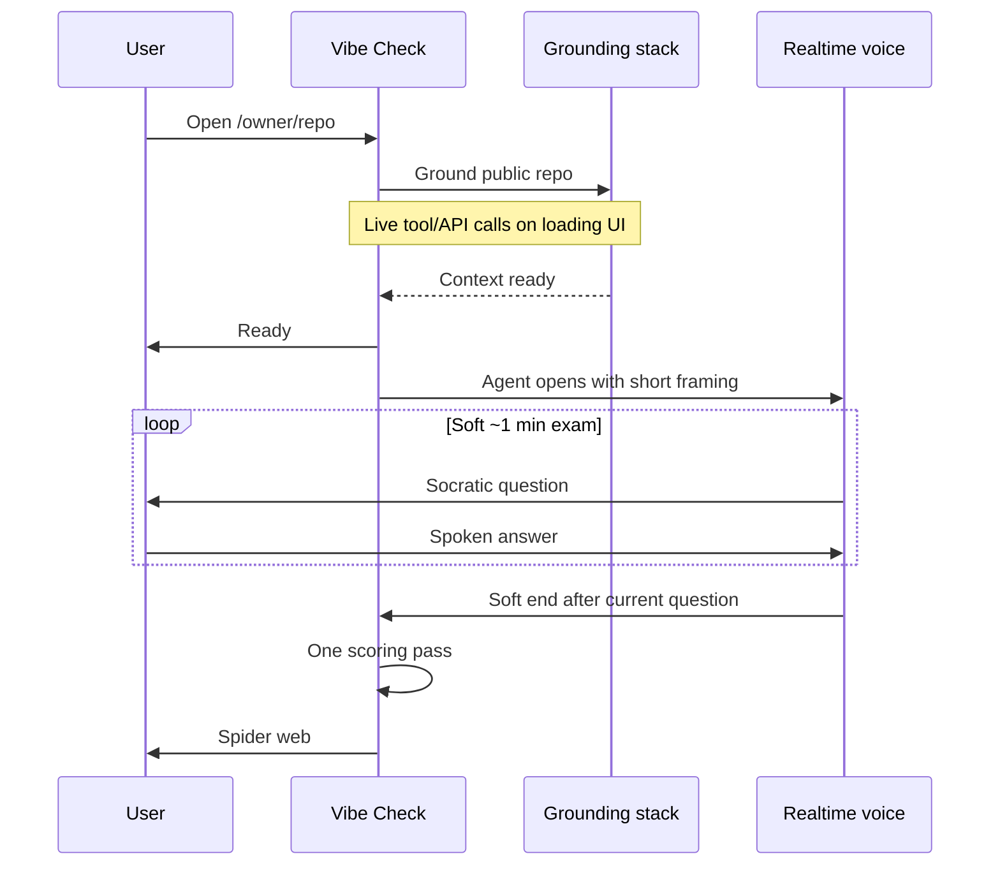

End-to-end v1 loop for Vibe Check. Only steps that are decided are listed.

## 1. Enter

User opens `/{owner}/{repo}` for a **public** GitHub repository (no OAuth, no private repos in v1). Host domain TBD; path shape fixed.

## 2. Grounding

Before the interview:

- Use **Codex SDK + Exa** (and GPT-5.6 for synthesis) to ground agent context.
- Show **live API / tool calls** on the loading screen (not a black box).
- Target grounding completion on the order of **under ~30 seconds** when the stack is healthy.
- Questions are **not** drawn from a fixed bank; **Codex SDK generates Socratic questions dynamically** from grounded context.

Exact ingest file set / brief schema is **not** fixed yet.

## 3. Ready

Interview clock starts **after** Ready — grounding time is separate from the ~1 minute exam.

## 4. Voice exam

- **Realtime API voice only** — no text fallback.
- **Agent opens** with a short framing turn, then the first Socratic question.
- Session is a **long-style multi-turn oral exam** in a short wall-clock window (~**1 minute** for demo; soft timer).
- **Soft timer:** aim for ~60s, **finish the current question**, then end.
- If the user freezes or says they don’t know: **one scaffold** (hint, point at code, simpler re-ask), then move on if still stuck.

## 5. Scoring and spider

- **One scoring pass at the end** (not continuous mid-exam scoring).
- **Model judgment only** for layer scores (no separate user self-score UI in the locked design).
- Result artifact: **spider web of system layers** (see [spider-axes](spider-axes.md)).
- Unprobed layers render as **not assessed** — not zeros and not model guesses.

## 6. Persistence

**localStorage** only for v1 (e.g. last scores per `owner/repo`). No accounts.

## Failures

On load/grounding failure: **retry 1–2 times**, then **hard fail** with a clear error if still unusable.
