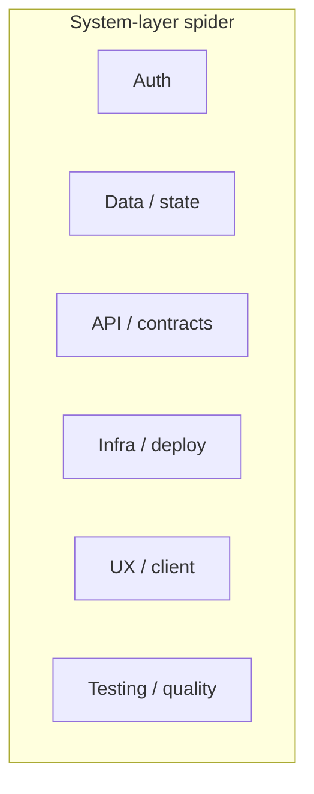

The end-of-session artifact is a **spider (radar) web** over **system layers**. Reaching this chart is the session success condition.

## Axes (locked)

| Spoke | Layer |
|---|---|
| 1 | Auth |
| 2 | Data / state |
| 3 | API / contracts |
| 4 | Infra / deploy |
| 5 | UX / client |
| 6 | Testing / quality |

## Scoring rules (locked)

| Rule | Decision |
|---|---|
| Who scores | Model judgment only (from the conversation) |
| When | Single pass after the soft-ended exam |
| Unprobed spokes | **Not assessed** (honest gap — not 0, not inferred) |
| Probes in ~1 min | Expect only a subset of layers to be deeply tested |

## Not decided yet

Internal precision factors, debrief copy, and whether scores update mid-session are out of this page on purpose.
