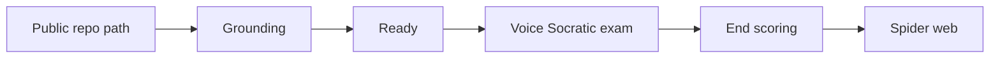

Vibe Check helps solo builders reclaim ownership of code they vibe-coded or AI-assisted. The user opens a public GitHub-shaped path, the product grounds on the repo with a visible research phase, then runs a short **voice-only Socratic oral exam**. The session ends with a **system-layer spider web** of what they can actually defend.

**Build Week track:** Education.  
**Working name:** vibe-check. Host TLD is not fixed; path shape is `/{owner}/{repo}`.

## Product promise

Give Vibe Check a public GitHub repo → defend it out loud → see where ownership is real vs knowledge debt.

## Primary user

Solo builder who wants to get better and be **accountable** for code they shipped (often with AI). Not framed as a tool for interviewers, teachers, or spectators in v1.

## Success of a session

A use of the product **worked** when the user reaches the **spider web** at the end of the oral exam.

## Related

- [Core loop](core-loop.md)
- [Spider axes](spider-axes.md)
- [v1 scope](v1-scope.md)
- [Build Week constraints](build-week.md)
